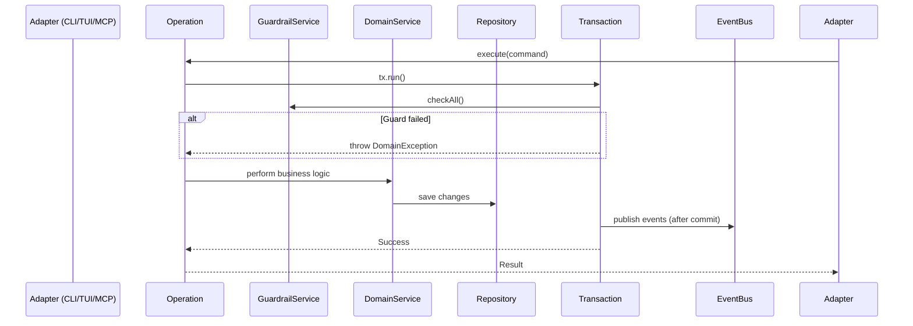

---
**TM HTM — Архитектура пакета `tm_core`**
**Версия документа**: 1.0  
**Дата**: 04 мая 2026  
---

# Архитектура пакета `tm_core`

## 1. Введение

**`tm_core`** — это **чистое ядро** системы TM HTM, полностью независимое от инфраструктуры (БД, CLI, TUI, MCP).

Пакет реализует всю бизнес-логику системы согласно спецификации TM HTM v3.3-final, придерживаясь принципов **Clean Architecture**, **Domain-Driven Design** (DDD) и **Event-Driven Architecture**. (see spec.md for detailed requirements)

### Основные цели `tm_core`

- Содержать **всю** бизнес-логику и правила системы.
- Быть максимально **тестируемым** (unit + integration тесты без реальной БД).
- Обеспечивать **атомарность** и **гарантии инвариантов** через Guards и транзакции.
- Поддерживать расширяемость (plugins, custom guards, custom policies).
- Быть полностью независимым от фреймворков и внешних сервисов.

---

## 2. Высокоуровневая структура пакета

```txt
tm_core/
├── lib/
│   ├── src/
│   │   ├── domain/              ← Бизнес-сущности и правила
│   │   ├── application/         ← Use Cases (Operations + Queries)
│   │   ├── di/                  ← Модули Injectable
│   │   └── tm_core.dart         ← Public API
│   └── tm_core.dart
│
├── test/
│   ├── unit/                    ← Тесты Domain (Services, Guards, Utils)
│   ├── integration/             ← Тесты Operations + in-memory DB
│   └── fixtures/                ← Тестовые данные
│
└── pubspec.yaml
```

---

## 3. Слои архитектуры `tm_core`

### 3.1 Domain Layer (`lib/src/domain/`)

Это **сердце** системы. Содержит только бизнес-правила, не знает о БД, HTTP или UI.

**Подпапки:**

**`entities/`**

- `Task`, `TaskLink`, `KnowledgeEntity`, `Reflection`, `Project`
- Используются `freezed` + `copyWith` для иммутабельности.
- Содержат базовую валидацию.

**`value_objects/`** (ключевой слой!)

- `TaskRef`, `NormalizedAlias`, `BusinessValue`, `UrgencyScore`
- `EffectivePriority`, `StalenessScore`, `PlanVersion`
- `CompletionPolicy`, `ContextState`, `TaskStatus`
- extension type или sealed classes
- Каждый Value Object содержит:
  - Валидацию (в конструкторе или factory)
  - Бизнес-правила (например, Hard Cap логику)
  - Методы сравнения и расчёта

**`events/`**

- Все Domain Events:
  - `TaskCompleted`
  - `TaskReplanned`
  - `ActiveFrontChanged`
  - `StallDetected`
  - `TaskMoved`, `LinkAdded`, `KnowledgeLinked` и т.д.

**`guards/`**

- `PnrGuard`
- `HardCapGuard`
- `CycleDetectionGuard`
- `CompletionPolicyGuard`
- `StalenessGuard`
- `ReflectionBudgetGuard`
- `GuardrailService` — оркестратор (выполняет все нужные guards)

**`services/`** (Domain Services)

- `PriorityService` — расчёт HBP (Hierarchical Business Priority)
- `HierarchyService` — работа с деревом, `isCompletable`, depth
- `ReplanningService` — атомарная логика `task_replan`
- `KnowledgeBridgeService` — `kg_auto_bridge` + soft link generation
- `StalenessService`
- `CompletionService`
- `GraphService` — топосортировка, cycle detection

**`utils/`**

- Чистые функции:
  - `calculateEffectivePriority()`
  - `normalizeAlias()`
  - `topologicalSort()`
  - `detectCycle()`
  - `calculateStaleness()`
  - `buildActiveFront()`

**`exceptions/`**

- Все доменные ошибки: `StallDetected`, `CycleException`, `HardCapViolation`, `InvalidAlias`, `TaskNotFound`, `ReplanValidationError` и т.д.

---

#### 3.2 Application Layer (`lib/src/application/`)

Слой Use Cases. Оркестрирует выполнение операций.

**`operations/`** (основной паттерн для мутаций)
Каждый файл — отдельная операция:

- `TaskReplanOperation`
- `TaskDoneOperation`
- `TaskBreakdownOperation`
- `TaskMoveOperation`
- `KgTaskLinkOperation`
- `TaskSetContextOperation`
- `TaskStartOperation`
- и т.д.

**Структура типичной Operation:**

```dart
class TaskReplanOperation {
  final TransactionPort tx;
  final TaskRepository repo;
  final GuardrailService guards;
  final ReplanningService replanningService;
  final DomainEventBus eventBus;

  Future<Result<TaskReplanResult>> execute(TaskReplanCommand cmd) async {
    return tx.run(() async {
      // 1. Загрузка данных
      final task = await repo.getByRef(cmd.taskRef);
      
      // 2. Guards
      await guards.checkAll([...]);
      
      // 3. Бизнес-логика
      final result = await replanningService.replan(task, cmd.changes);
      
      // 4. Сохранение
      await repo.saveAll(result.affectedTasks);
      
      // 5. События
      eventBus.publish(TaskReplanned(...));
      
      return Success(result);
    });
  }
}
```

**`queries/`** (read-only)

- `GetActiveFrontQuery`
- `GetTaskTreeQuery`
- `GetTaskDetailQuery`
- `GetKnowledgeEntitiesQuery`
- и т.д.

**`ports/`** (интерфейсы / контракты)

- `TaskRepository`
- `LinkRepository`
- `KnowledgeRepository`
- `ReflectionRepository`
- `TransactionPort`
- `DomainEventBus`
- `TracingPort`

**`services/`** (Application Services) — при необходимости (например, сложная оркестрация нескольких Operations).

---

## 4. Принципы и паттерны

| Принцип | Реализация |
| ------- | ---------- |
| **Immutability First** | freezed entities + Value Objects |
| **Fail Fast** | Guards в самом начале операции |
| **Atomicity** | Все мутации внутри `TransactionPort` |
| **Pure Domain Logic** | Максимум в utils и Domain Services |
| **Events for Side Effects** | Domain Events публикуются только после коммита |
| **Result Pattern** | `Result<T>` (fpdart или собственный) вместо exceptions для expected ошибок |
| **CQRS** | Operations (write) vs Queries (read) |
| **Dependency Inversion** | Application зависит от Domain, Infrastructure зависит от Application |

---

### 5. Основной поток мутирующей операции



---

### 6. Dependency Injection

Используется пакет **`injectable`**.

```dart
// lib/src/di/core_module.dart
@module
abstract class CoreModule {
  @singleton
  DomainEventBus get eventBus => DomainEventBusImpl();

  @lazySingleton
  GuardrailService get guardrailService;
  
  // Operations
  @lazySingleton
  TaskReplanOperation get taskReplanOperation;
}
```

---

### 7. Public API (`lib/tm_core.dart`)

```dart
// Основные экспорты
export 'src/domain/entities/task.dart';
export 'src/domain/value_objects/task_ref.dart';
export 'src/application/operations/task_replan_operation.dart';
export 'src/application/queries/get_active_front_query.dart';
export 'src/domain/events/task_replanned.dart';
// ...
export 'src/tm_core.dart'; // основной фасад
```

---

### 8. Тестирование

- **Unit-тесты**: Domain Services, Guards, Utils, Value Objects, Pure Functions.
- **Integration-тесты**: Operations с in-memory реализацией репозиториев (Drift in-memory или Fake repositories).
- **Property-based testing** (для cycle detection, HBP, PNR).
- **Golden tests** для Active Front.

---

### 9. Рекомендации по реализации

1. Начать с **Value Objects** и **Entities**.
2. Затем **Guards** и **Utils**.
3. **Domain Services**.
4. **Operations** (по одной, начиная с простых).
5. **Queries**.
6. Настроить DI и тесты.

**Зависимости (pubspec.yaml):**

- `freezed`, `json_annotation`
- `uuid`, `time`, `collection`

---

### 10. Преимущества данной архитектуры

- Полная независимость от SQLite (можно легко заменить на PostgreSQL или in-memory).
- Отличная тестируемость.
- Чёткая ответственность слоёв.
- Легко добавлять новые возможности (новые guards, policies, types of links).
- Соответствует всем требованиям спецификации TM HTM v3.3 (HBP, PNR, атомарность replan, Hard Cap и т.д.).

---

**Следующие шаги (рекомендуется):**

1. Создать детальный ADR (Architecture Decision Record) по выбору Result Pattern и Event Bus.
2. Начать разработку с `value_objects` и `guards`.
3. Подготовить базовые тесты для HBP и Cycle Detection.

---

Документ готов к использованию как основа для разработки.

Хотите, чтобы я дополнил его:

- Примерами кода конкретных классов?
- Диаграммами Mermaid/C4?
- Детальным описанием `TaskReplanOperation`?
- Структурами Value Objects?

Готов углубить любой раздел.
